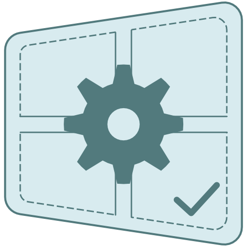
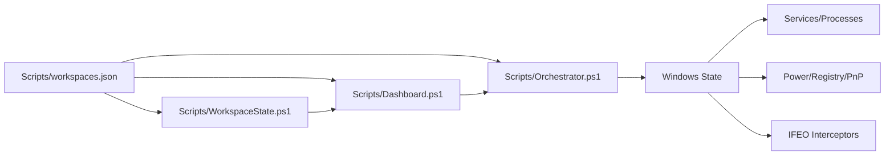

# WorkspaceManager



WorkspaceManager is a declarative Windows state orchestrator. A single `Scripts\workspaces.json` defines what your machine should look like for each context: services, applications, power plans, registry values, PnP devices, and optional launch interceptors.

User-facing text, shortcuts, and UI use the WorkspaceManager name. Managed IFEO metadata uses the owner tag `BG-Services-Orchestrator` so cleanup only touches hooks owned by this deployment (details in [DOCs/Edge-Cases.md](DOCs/Edge-Cases.md)).

## What you get

### Configuration model

- `_config` controls global behavior like notifications, interceptor sync, poll timeout, and shortcut prefixes.
- `Hardware_Definitions` is the reusable component catalog (service, registry, PnP device, process, stateless, or scripted overrides).
- `System_Modes` defines power plan and target ON/OFF/ANY state per component.
- `App_Workloads` defines nested domains and workloads with services, executables, tags, aliases, and optional intercept rules.

See [DOCs/Configuration.md](DOCs/Configuration.md) for the full contract; a collapsible cross-link index is under [Configuration schema reference](#configuration-schema-reference).

### Orchestrator

`Scripts\Orchestrator.ps1` resolves profile type, syncs managed interceptors when enabled, and executes Start/Stop for workloads, system modes, or hardware overrides. Root `Orchestrator.cmd` is the convenience launcher. It supports explicit profile routing and sync-only workflows used by the Dashboard.

Execution details: [DOCs/Orchestrator-Flow.md](DOCs/Orchestrator-Flow.md)

### Dashboard

`Scripts\Dashboard.ps1` is a console UI for workload control, system mode blueprinting, hardware compliance/overrides, and `_config` settings commits. Tab 2 appears only when more than one system mode exists, and mode blueprint state persists in `Scripts\state.json` beside `Scripts\workspaces.json`.

UI behavior and keys: [DOCs/Dashboard.md](DOCs/Dashboard.md)

### Interceptors (optional)

When `_config.enable_interceptors` is enabled, IFEO rules can prime required services/executables before selected target executables launch. You can reset managed interceptors from Dashboard Tab 4.

Reference: [DOCs/Configuration.md](DOCs/Configuration.md), [DOCs/Edge-Cases.md](DOCs/Edge-Cases.md)

### Shortcuts and launch entry points

- `Generate-Shortcuts.cmd` creates Start/Stop shortcuts for each mode and workload in `%APPDATA%\Microsoft\Windows\Start Menu\Programs\WorkspaceManager`. When `Assets\Dashboard.ico` is present, those `.lnk` files use it in Explorer; re-run this command after upgrading the repo so shortcuts pick up icon or path changes.
- `Scripts\Run-Dashboard.cmd` launches the dashboard from repository root context.
- `Setup.cmd` creates `Workspace Manager Dashboard.lnk` in the repository root, then lets you toggle optional Desktop and Start Menu shortcuts.
- If interceptors are enabled and you just upgraded from an older layout, run one orchestrator or dashboard commit cycle to re-sync IFEO Debugger paths to `Scripts\Interceptor.vbs`.

**Icons in Explorer and on the taskbar:** `.cmd` files cannot show a custom Explorer icon. Use `.\Setup.cmd` to create `.lnk` launchers with `Assets\Dashboard.ico`; pin the desktop or repo-root shortcut if you want a branded tile. The **live** console window may still show the PowerShell icon unless you run inside **Windows Terminal** with a profile that sets `icon` to `Assets\Dashboard.ico`—see [DOCs/Windows-Terminal.md](DOCs/Windows-Terminal.md).

**GitHub / social preview:** Repository images and social preview are set in the GitHub repo **Settings** (not via a committed file). Upload `Assets\Logo.png` there if you want link previews to show the logo.

## Architecture at a glance



## Prerequisites

1. Windows 10 or 11
2. PowerShell 7 (`pwsh.exe`)
3. [gsudo](https://github.com/gerardog/gsudo) (recommended: `scoop install gsudo` then `gsudo config CacheMode Auto`)

Orchestration operations that change machine state are executed through `gsudo` in the relevant script paths.

## Quick start

1. Clone the repository and open the repository root.

```powershell
git clone https://github.com/zunaidFarouque/WorkspaceManager.git
cd WorkspaceManager
```

2. Create or edit `Scripts\workspaces.json` using the documented shape.

```json
{
  "_config": {},
  "Hardware_Definitions": {},
  "System_Modes": {},
  "App_Workloads": {}
}
```

Use [DOCs/Configuration.md](DOCs/Configuration.md) for field-by-field rules and execution token syntax.

3. (Optional) Generate Start Menu shortcuts.

```powershell
.\Generate-Shortcuts.cmd
```

4. Run headless orchestration or open the dashboard.

```powershell
.\Orchestrator.cmd -WorkspaceName "My_Mode" -Action "Start"
```

```powershell
.\Scripts\Run-Dashboard.cmd
```

Optional setup helper:

```powershell
.\Setup.cmd
```

When using the dashboard, `Scripts\state.json` is written beside `Scripts\workspaces.json` to persist active system mode blueprint state.

## Configuration schema reference

WorkspaceManager's machine-readable schema, field rules, and execution-token syntax are maintained in **[DOCs/Configuration.md](DOCs/Configuration.md)**.

<details>
<summary>Supporting documentation</summary>

- [DOCs/_schema.md](DOCs/_schema.md) — stable hub for links from other `DOCs/` pages (points here).
- [DOCs/Architecture.md](DOCs/Architecture.md) — how `Hardware_Definitions`, `System_Modes`, and `App_Workloads` fit together.
- [DOCs/Orchestrator-Flow.md](DOCs/Orchestrator-Flow.md) — orchestrator phases and parameters.
- [DOCs/Dashboard.md](DOCs/Dashboard.md) — console UI, keys, commits.
- [DOCs/Edge-Cases.md](DOCs/Edge-Cases.md) — operational caveats.
- [DOCs/Audit.md](DOCs/Audit.md) — doc ↔ implementation matrix (maintenance checklist).
- [DOCs/Windows-Terminal.md](DOCs/Windows-Terminal.md) — optional profile with `Dashboard.ico` for tabs and taskbar.

This block replaces the former root `Schema.md` entry point so the specification stays in one place without duplicating it.

</details>

## Documentation

| Document | Topic |
|----------|-------|
| [DOCs/Architecture.md](DOCs/Architecture.md) | Components, boundaries, naming, and runtime model |
| [DOCs/Configuration.md](DOCs/Configuration.md) | JSON schema, tokens, intercept rules, and shortcut behavior |
| [DOCs/Orchestrator-Flow.md](DOCs/Orchestrator-Flow.md) | Parameters, phases, routing, and execution order |
| [DOCs/Dashboard.md](DOCs/Dashboard.md) | Tab behavior, keybindings, commit flow, and actions |
| [DOCs/Edge-Cases.md](DOCs/Edge-Cases.md) | Operational caveats, risks, and mitigations |
| [DOCs/Audit.md](DOCs/Audit.md) | Doc-to-implementation verification matrix |
| [DOCs/Windows-Terminal.md](DOCs/Windows-Terminal.md) | Windows Terminal profile for dashboard icon on tab/taskbar |
| [Configuration schema reference](#configuration-schema-reference) | Collapsible index; [DOCs/_schema.md](DOCs/_schema.md) is the stable `DOCs/` link target into this section |

## Testing

Pester tests also act as behavior contracts for the main components:

- `tests\Orchestrator.Tests.ps1`
- `tests\Dashboard.Tests.ps1`
- `tests\WorkspaceState.Tests.ps1`
- `tests\Interceptor.Tests.ps1`

Run from repository root:

```powershell
Invoke-Pester -OutputFormat NUnitXml -OutputFile .\tests\testResults.xml
```

## Limitations and safety notes

- Shared services across workloads are not dependency-resolved globally; commit order can matter when profiles overlap.
- Workload stop operations use `taskkill` by executable leaf name and can terminate unsaved applications.
- Workload names should be unique across all `App_Workloads` domains to avoid ambiguous resolution.
- IFEO-based interception can interact with endpoint security policy; disable interceptors when troubleshooting policy conflicts.

## License

Distributed under the MIT License. See [LICENSE](LICENSE).
